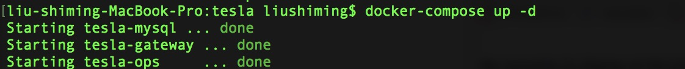
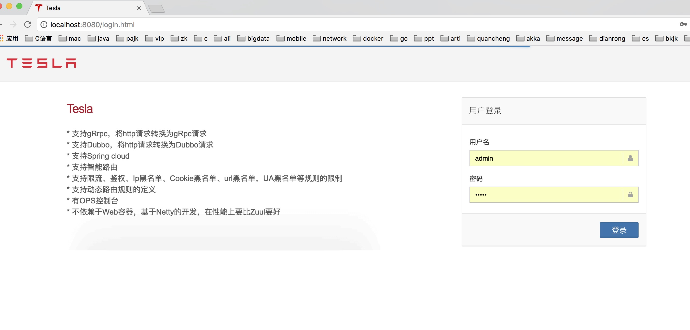

# 概述

* Tesla是一个微服务API网关，类似于netflix的zuul

# 功能

* 支持gRrpc，将http请求转换为gRpc请求
* 支持Dubbo，将http请求转换为Dubbo请求
* 支持Spring cloud
* 支持智能路由
* 支持限流、鉴权、Ip黑名单、Cookie黑名单、url黑名单，UA黑名单等规则的限制
* 支持动态路由规则的定义
* 支持参数裁剪及参数转换
* 有OPS控制台
* 不依赖于Web容器，基于Netty的开发，在性能上要比Zuul要好

# 详细说明
 
 tesla-gateway: 反向代理并执行路由规则
 
 tesla-ops: API维护、规则维护
 
# 使用说明

 * mvn打包及打镜像
 
 ```
   mvn clean package
 ```
 
 * 在根目录下运行,成功如下图
 
 ```
 docker-compose up -d
 ```
 
 
 * 访问ops控制台,维护规则
 http://localhost:8080
 
 
 
 * 访问gateway真正路由转发
  http://localhost:9000